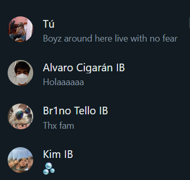

# Introducción a Señales Biomédicas
## *Primer entregable*
## Tabla de contenido:
* #### [**Bienvenida**](#bienvenida)
* #### [**Integrantes**](#integrantes)
---
### Bienvenidos al repositorio del grupo 5 :)
## Integrantes:

###### Después lo ponemos más serio (no tenemos fotos juntos)
| **Integrante** | **Correo**|
| ---------| ----------|
| Nadira Oviedo | nadira.oviedo@upch.pe |
| Alvaro Cigarán | alvaro.cigaran@upch.pe |
| Kimberly Tito | kimberly.tito@upch.pe |
| Bruno Tello | gustavo.tello@upch.pe |
